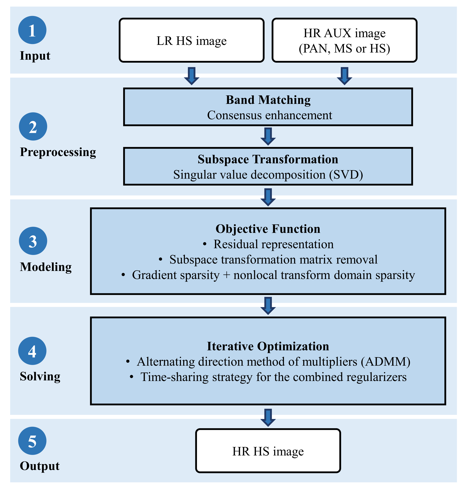

## **SDCS: Subspace Dynamic Combined Sparsity-Based Hyper-Sharpening for Diverse Auxiliary Images, TGRS, 2024.**

**This repository contains demo programs for SDCS and other parameter combinations used in the paper.**
### Usage

+ Please add all subfolders of the source code to the matlab search path and execute *SDCS_demo.m* 

### Other Notes
+ This code is constructed primarily based on the dynamic total variation and ADMM-PnP. For the executability of the program, the codes of BM3D, CNMF and GLP-HS utilized in the program are also included.

+ For convenience, the code repository contains Moffett Field and Chikusei data used in the paper. The rest of the data can be accessed from the links mentioned in the paper.
  
+ The data and some third-party tools or functions contained in the code package should be copyrighted to the corresponding authors and organizations.

+ If this code is helpful to your work, please cite our paper: https://doi.org/10.1109/TGRS.2024.3382402

+ For questions, please contact: blueuranus@qq.com.
